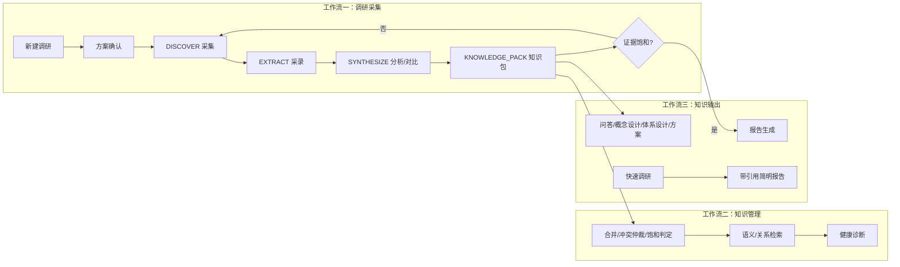

# 调研管理平台

> 一个把"调研"变成**可检查、可追溯、可沉淀、可复用、可知识输出**工程流程的 agent 工作流平台。
> 基于 opencode agent 体系构建，面向需要严肃、可信、可复用知识产出的个人与团队。

调研的难，不止于"会不会搜"——查什么、怎么判断信息靠不靠谱、结论凭什么站得住、做完的东西下次还能不能用、怎么变成能交付的答案与报告，每一步都可能失守。本项目把调研拆成一条有闸门、有状态、有证据链的流水线，从采集到知识沉淀到报告输出，让每次调研都留下**可复用的知识资产**，而不是一段聊天记录。

---

## 一句话定位

**调研管理平台 = 状态机驱动的知识工作平台**，覆盖三大工作流：**调研采集、知识管理、知识输出**。



---

## 三大工作流

### 工作流一：调研采集（标准状态机）

从"新建项目 → 方案确认 → 连续采集/采录/分析 → 知识包 → 饱和判定 → 报告放行"，每一步都有明确状态、产物与质量门槛：

- **状态机驱动**：`DISCOVER → EXTRACT → SYNTHESIZE → KNOWLEDGE_PACK → CLOSED_LOOP → REPORT_ALLOWED` 的明确阶段流转，每个阶段都有产物与退出条件。
- **方案确认闸门**：新建调研不会直接开搜。先产出调研方案草案（研究目标、策略映射、初始问题），经你确认后才进入正式采集，杜绝"边搜边改、目标漂移"。
- **证据链不可替代**：搜索摘要 ≠ 原始资料，自然语言总结 ≠ 分析，报告 ≠ 知识包。任何一环缺失都会在闸门被拦截。
- **连续执行模式**：方案确认后按批次持续推进，阶段性汇报不等于暂停；只有命中停止条件（用户停止、证据饱和、报告闸门满足等）才停。
- **可恢复、可续跑**：项目状态随时可查（`/检查调研`），中断后可无缝续跑，适合跨多天、多轮次的长周期调研。

### 工作流二：知识管理（让知识成为资产）

平台不是"调研完就丢"的报告生成器，**知识包是核心资产**：

- **知识单元化**：调研成果沉淀为带证据、带边界、带反例、可更新的知识断言（claims），而非整篇文档。
- **一键整理**：`/整理知识` 触发全面审计——合并重复断言、仲裁冲突、治理无边界断言、评估线索、更新视图。
- **多维检索**：语义向量检索（弥合词汇差异）、关键词精确检索、关系图谱跳转、概念反向索引，随时回答"平台里对这个问题知道什么"。
- **健康诊断**：孤儿断言/孤证/悬挂关系/未仲裁冲突/embedding 缺口/线索积压，一键体检知识包质量。
- **饱和判定**：知识包证据饱和时才放行报告，避免"没调研完就下结论"。

### 工作流三：知识输出（多样化的消费方式）

知识资产可以有多种输出形态：

- **报告**：报告 agent 读取知识包 + L0 视图，生成**自然语言 Markdown 报告**（不是模板堆砌），可经 html-report 渲染为 HTML，或用 super-slide 生成**幻灯片**。
- **问答**：直接基于调研成果提问，AgenticRAG 迭代检索，回答可追溯回知识断言与来源。
- **概念设计 / 体系设计 / 方案输出**：基于知识包做知识推理与派生，立场、判断、推荐都在此产生，且必须可追溯到证据。
- **快速调研（轻量摸底）**：不建项目，直接出带强制引用的简明报告，适合快速结论、竞品快查、争议验证。

---

## 核心能力

| 能力 | 说明 |
|---|---|
| 状态机 + 闸门 | 每个阶段有产物与退出条件，报告/实施指南等产物在证据链满足前一律拦截 |
| 证据链工程 | raw → 采录 → 分析/对比 → 知识包，四层不可互相替代，全程可追溯 |
| 知识包体系 | 断言单元 + 语义/关键词/关系/概念四维检索 + 冲突仲裁 + 健康诊断 |
| 知识输出多样化 | 自然 Markdown 报告、HTML、幻灯片、问答、概念/体系设计、方案 |
| 多渠道入口 | 5 个斜杠命令 + 自然语言路由（见下），怎么顺手怎么来 |
| 可恢复续跑 | 状态随时可查、中断无缝续跑，适合长周期调研 |
| 多 agent 分工 | orchestrator / 项目管理员 / 调研员 / 采录员 / 知识管理员 / 报告 / 分析 / 图片分析 |
| 图片分析 | 对调研采集的图片做多模态分析，提取架构组件、文字、数据趋势、UI 元素 |

---

## 快速开始

### 环境要求

- [opencode](https://opencode.ai)（agent 运行时）
- Python 3.10+
- 一个可用的模型 provider（默认配置见 `opencode.json`，可按你的环境修改）

### 安装

复制运行包三件套到你的工作区：

```text
AGENTS.md
opencode.json
.opencode/
```

### 命令入口

| 命令 | 用途 |
|---|---|
| `/新建调研 <主题>` | 创建合规调研项目骨架，生成调研方案草案，停在方案确认 |
| `/继续调研 <项目名>` | 检查状态；方案已确认后按调研员状态机连续执行 |
| `/检查调研 <项目名>` | 只检查项目状态，不采集、不分析、不报告 |
| `/生成报告 <项目名>` | 报告闸门满足后调用报告 agent 生成报告 |
| `/整理知识 <项目名>` | 手动触发知识管理员全面审计（合并、冲突仲裁、知识包维护） |

### 自然语言路由（说人话就行）

平台以自然语言为主入口，所有请求先经过 orchestrator 意图识别：

| 你说什么 | 平台做什么 |
|---|---|
| `快速调研 X` / `简单调研 X` / `简明结论 X` | **快速调研模式**：直接出带引用的简明报告（见下节） |
| `调研 X` / `新建 X` / `新建调研 X` | 创建项目骨架 → 方案草案 → 停在方案确认 |
| `进入 X` / `继续 X` / `执行` | 检查状态；方案已确认后连续执行调研循环 |
| `修复 X` / `初始化 X` / `补齐配置` | 项目管理员修复模式，只补配置与规划缺口 |
| `整理知识` / `整理一下` | 知识管理员全面审计（知识包维护） |
| `检查调研 X` / `看进度` | 只输出项目状态，不执行 |
| `出报告` / `生成报告` | 先跑报告闸门，满足后调用报告 agent |
| `分析` / `问答` / `方案` / `设计` | 基于调研成果做知识问答与方案设计 |
| `列出项目` / `全局看板` | 列出所有项目并做 qmd 相关性检查 |

### 快速调研模式（轻量摸底）

不想建项目、只要一个"快速结论"时使用。与标准调研状态机并行，**直接输出报告，不建项目、不写知识包**。

- 触发词：`快速` / `简单` / `简明` / `速览` / `快查` + 明确调研对象（产品/公司/技术/话题/争议点）。
- 流程：意图拆解 → 提问澄清 → 多视角问题地图 → 多源搜索（国内 `bing, searxng, baidu`；国际 `google, bing, duckduckgo`）→ agentic 补搜 → 交叉验证 → 报告。
- 报告特点：强制内联引用 `[n]` + 引用列表；孤证标注"仅单一信源，待核实"；开头明示"快速摸底结论，非标准调研证据链产物"。
- 产物边界：不进入 DISCOVER/EXTRACT/SYNTHESIZE 状态机，不充当标准调研证据链；如需正式沉淀，另行走标准调研流程。
- 默认在对话中输出；用户明确要求落盘时写入 `快速调研目录/<主题>-YYYYMMDD.md`。

### 开箱验证

```powershell
.opencode/scripts/check-research-state.py --project-path ".opencode/模板库"
```

预期返回：

```json
{
  "project_valid": true,
  "plan_status": "draft",
  "approval_required": true,
  "next_stage": "PLAN_REVIEW",
  "report_allowed": false
}
```

---

## 项目结构

每个调研项目从 `.opencode/模板库/` 创建骨架：

```text
<项目名>/
├── project.config.md        # 静态项目定义（PLAN_REVIEW 后冻结）
├── run-state.md             # 运行时状态（批次进度、搜索词、死胡同）
├── 1-规划/
│   ├── 1-任务规划.md
│   ├── 2-讨论纪要.md
│   ├── 3-检查点协议.md
│   ├── 4-知识包设计.md
│   └── task_queue.md
├── 2-执行/
│   ├── 01-采集记录/          # 原始资料 raw-S*.md、采录记录
│   ├── 02-分析提取/          # 单源分析 分析-A*.md、跨源对比 对比-C*.md
│   ├── 03-知识提炼/          # 知识包 JSON、索引库
│   ├── 04-参考资料/
│   └── 05-过程产物/
├── 3-产出/                  # 报告等交付物
├── progress.md
└── findings.md
```

---

## Agent 结构

| Agent | 职责 |
|---|---|
| research-orchestrator | 默认入口。识别意图、读取项目状态、运行状态检查、按状态机路由、执行闸门。 |
| 项目管理员 | 创建/修复项目骨架、意图理解、预搜索、任务规划、产出 PLAN_REVIEW 草案。 |
| 调研员 | 方案批准后在项目内连续执行采集 → 采录 → 分析/对比，并挖掘新线索。 |
| 采录员 | 单篇处理：读取 → 价值判断 → 采录 → 分析 → 线索识别（弱模型即可承担）。 |
| 知识管理员 | 知识体系维护：合并、断言入库、冲突检测、线索评估、饱和判定。 |
| 报告 | 读取 L0 视图与知识包，生成自然语言 Markdown 报告。 |
| 分析 | 基于调研成果提供问答、概念设计、体系设计、方案输出。 |
| 图片分析 | 对调研采集的图片做多模态分析。 |

调研员按子阶段执行：采集 → 分析提取 → 质量闸门；知识体系维护由知识管理员负责。

---

## Skill 结构

> **Skill 单独开源说明**：本平台所用的 Skill 后续将**单独开源**（独立仓库发布），以便独立演进与复用。当前版本为开箱即用暂时内置在 `.opencode/skills/`；独立仓库地址发布后会在本节补充链接。欢迎按需选用、改造或独立分发。

| Skill | 用途 | 当前分发 |
|---|---|---|
| 多源搜索 | 搜索编排（国内 bing/searxng/baidu；国际 google/bing/duckduckgo；Tavily 按需） | 全局 skill（另行部署，后续单独开源） |
| 快速调研师 | 快速摸底调研：多视角 + agentic 检索闭环 + 强制引用 | 随包内置，后续单独开源 |
| zhishibao | 知识包管理：断言写入、语义/关键词/关系检索、索引、健康诊断 | 随包内置，后续单独开源 |
| qmd | 本地文档搜索与索引 | 随包内置，后续单独开源 |
| html-report | HTML 报告渲染 | 全局 skill（另行部署，后续单独开源） |
| super-slide | 幻灯片生成 | 随包内置，后续单独开源 |
| 去AI味儿 | 报告/文本润色 | 随包内置，后续单独开源 |
| opendataloader-pdf | PDF 文本提取 | 随包内置，后续单独开源 |

`多源搜索` 与 `html-report` 是全局 skill 例外，安装后平台采集与 HTML 渲染能力完整，缺失时其余功能不受影响。

---

## 状态机

`check-research-state.py` 是唯一的"项目现在该做什么"权威来源：

| next_stage | 含义 | 允许动作 |
|---|---|---|
| INVALID_PROJECT | 项目骨架不合规 | 调用项目管理员修复 |
| PLAN_REVIEW | 方案待确认 | 输出草案，等待确认，禁止采集 |
| DISCOVER | 采集原始资料 | 调研员批次执行 |
| EXTRACT | 补采录 | 调研员 |
| SYNTHESIZE | 分析/对比 | 调研员 |
| KNOWLEDGE_PACK | 知识包维护 | 知识管理员 |
| CLOSED_LOOP | 饱和判定 | 知识管理员 |
| REPORT_ALLOWED | 允许报告 | 报告 agent |

---

## 调研策略层

三层轻量策略模型，决定"怎么挖、怎么取证、怎么判断质量"：

```yaml
research_type:   决定最终产物（技术调研/源码调研/决策支持/市场商业/…）
research_subtype: 描述具体任务（产品选型/需求发现/技术选型/…）
strategy_tags:   决定来源处理（社区反馈/电商评价/售后投诉/官方参数/专业评测/…）
```

内置策略文件位于 `.opencode/research-strategies/`（types / scenarios / sources）。技术类与选型类策略较成熟，作为发布版样板；其余类型提供最小骨架便于扩展。

---

## 质量保障：报告闸门

报告/实施指南/总结类产物生成前必须满足：

| 条件 | 要求 |
|---|---|
| 原始资料 | raw-S*.md ≥ 3 |
| 采集记录 | 采集记录-S*.md 或 采录-S*.md ≥ 3 |
| 分析/对比 | 分析-A*.md 或 对比-C*.md ≥ 1 |
| 知识包 | knowledge-pack*.json 存在且非空 |
| 一致性检查 | 知识包无未仲裁冲突断言、无过期对比文档 |

**诚实边界声明**：闸门验证的是"证据链是否完整、知识包是否一致、冲突是否仲裁"，**不验证断言内容是否事实正确**。事实准确性由来源可信度 + 多源交叉验证 + 分析员判断共同保障。报告如实表述"已通过结构一致性检查"，不宣称"已通过质量验证"。

---

## 适用场景

- 技术调研、源码调研
- 市场/商业调研、竞品分析
- 政策/法规调研
- 产品/技术选型、决策支持
- 文史/人文调研、知识创作素材调研
- 舆情与用户声音研究
- 长期跟踪的知识体系建设（调研成果沉淀为可复用的知识资产）

---

## 已知限制与路线

- 社区平台抓取能力仍在建设中：搜不到全文时记录为线索/死胡同/能力缺口，不静默忽略。
- `多源搜索`、`html-report` 作为全局 skill 单独部署，不随运行包发布；没有它们时平台仍可完成骨架、状态检查、方案确认与已有资料分析，只是网络采集/HTML 渲染受限。
- 当前发布包以 Windows PowerShell 脚本为主。
- 报告 agent 只生成自然 Markdown，HTML 渲染由 html-report skill 负责。

---

## 运行包边界

**运行时只读取两处**：本运行包（AGENTS.md + opencode.json + .opencode/）与目标调研项目目录。README、样例项目、临时记录目录都不是运行依赖。

发布/分发时：

```text
应包含：
  AGENTS.md
  opencode.json
  .opencode/
  README.md

不应包含：
  node_modules/、package-lock.json
  历史调研项目目录
  .task/ 等本地过程记录
  本机绝对路径
```

---

## 许可证

本项目基于 **Apache License 2.0** 发布（见 [LICENSE](LICENSE)）。

**运行产物归属声明**：平台运行产生的调研内容、知识包、报告等数据资产归用户所有，不受本项目许可证约束。

---

## 贡献

欢迎 Issue 与 PR。改动的核心原则：

- **不靠猜**：agent 必须有清晰约束，动作必须先从文件状态读取，再按状态机执行。
- **不破坏证据链**：任何改动不得让"搜索摘要/总结/报告"混入"原始资料/采录/分析"层级。
- **保持可移植**：新能力优先落在 `.opencode/` 内，不引入外部运行依赖。

---

## 鸣谢

本平台所用的 Skill 部分直接使用、部分深度借鉴了以下开源项目与社区成果，特此致谢：

| Skill | 上游来源 |
|---|---|
| qmd | 直接使用 npm 开源包 `@tobilu/qmd`（本地文档搜索引擎）；检索与重排序基于 Qwen 系列开源模型（Qwen3-Embedding、Qwen3-Reranker） |
| opendataloader-pdf | 直接使用同名开源项目（PyPI / npm / Maven 多通道分发）；混合 AI 模式基于 IBM 开源文档解析工具 Docling；布局与阅读顺序分析借鉴 XY-Cut++ 算法 |
| 多源搜索 | 搜索编排参考开源元搜索引擎 SearXNG，并集成 Bing、Baidu、Google、DuckDuckGo、Tavily 等开放接口 |
| html-report / super-slide / 快速调研师 | 平台自研，设计思路受开源 agent skill 生态启发 |

独立 Skill 仓库开源后将补充各 Skill 的详细依赖清单与许可证声明。

此外，本项目的调研方法论、工作流设计与技术思路广泛借鉴了众多开源项目与社区实践，受益良多，在此一并致谢，恕不一一列举。
